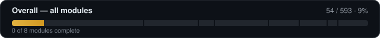
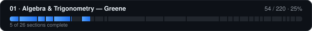
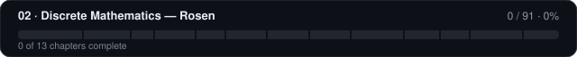
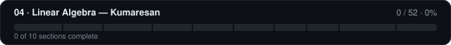
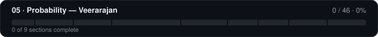

# curriculum-math

A complete mathematics curriculum built for one purpose: the math foundation needed to become
competent in five areas of programming:

| Tag | Goal |
|-------|------|
| `[GFX]` | 2D graphics & physical simulation |
| `[CMP]` | Compiler engineering |
| `[NET]` | Computer networking |
| `[DB]` | Relational databases |
| `[CRY]` | Cryptography |

The curriculum is modeled on Mr. Greene's college math course: every skill is one atomic lesson,
and every lesson follows the same rhythm.

## Progress

Every lesson in the six module files is a markdown checkbox. Tick boxes as you complete
lessons, then run:

```sh
go run ./tools/progress
```

The tool re-counts every checklist, redraws the SVG progress bars below, refreshes the
`N / M complete` lines in each module file, and writes the raw numbers to
`progress/progress.csv`.

<!-- progress:overall -->


[](01-algebra-trigonometry-map.md)
[](02-discrete-mathematics-map.md)
[](03-calculus.md)
[](04-linear-algebra.md)
[](05-probability.md)
[](06-numerical-methods.md)

**Total: 29 / 516 lessons complete · 6%** — [completion log](LOG.md) · raw numbers in [progress/progress.csv](progress/progress.csv)
<!-- endprogress -->

## The rhythm (from Mr. Greene's course)

Every numbered lesson in this curriculum means **three things**, exactly as in the Greene course:

1. **Lesson** — learn the skill (each lesson lists the book section to read, or use a video).
2. **Study Notes** — write your own one-page summary of the skill, in your own words.
3. **Practice Test** — work exercises from the referenced book section until you can solve them
   cold, without notes.

A lesson is not done until all three are done. Never just read and move on — the practice is the
curriculum.

## Tags

Each section or lesson is tagged with the goal(s) it *directly* serves. **No tag does not mean
"skip"** — it means the lesson is load-bearing foundation for tagged lessons that come later.
This curriculum follows the complete standard course structure for every subject; the tags tell
you *why* you are learning something, never *whether*.

## The library

| Book / course | Module | Alternative |
|---|---|---|
| Mr. Greene — *College Math* (course) | `01` | — |
| Rosen & Krithivasan — *Discrete Mathematics and Its Applications* (McGraw-Hill India) | `02` | — |
| *Thomas' Calculus* (Pearson India edition) | `03` | Shanti Narayan, *Differential/Integral Calculus* (S. Chand) |
| S. Kumaresan — *Linear Algebra: A Geometric Approach* (PHI) | `04` | Strang, *Introduction to Linear Algebra* + free MIT OCW lectures |
| T. Veerarajan — *Probability, Statistics and Random Processes* (McGraw-Hill India) | `05` | Sheldon Ross, *A First Course in Probability* (Pearson India) |
| S.S. Sastry — *Introductory Methods of Numerical Analysis* (PHI) | `06` | — |

Reference shelf (not required, useful for life): B.S. Grewal, *Higher Engineering Mathematics*
(all subjects in one volume); Kishor Trivedi, *Probability and Statistics with Reliability,
Queuing and Computer Science Applications* (the second probability book, when networking gets
serious).

## The modules

| File | Contents | Kind |
|---|---|---|
| [`01-algebra-trigonometry-map.md`](01-algebra-trigonometry-map.md) | Study map through the Greene course | Map of what you own |
| [`02-discrete-mathematics-map.md`](02-discrete-mathematics-map.md) | Study map through Rosen & Krithivasan | Map of what you own |
| [`03-calculus.md`](03-calculus.md) | Complete skill-by-skill calculus curriculum | New material (gap) |
| [`04-linear-algebra.md`](04-linear-algebra.md) | Complete skill-by-skill linear algebra curriculum | New material (gap) |
| [`05-probability.md`](05-probability.md) | Complete skill-by-skill probability curriculum | New material (gap) |
| [`06-numerical-methods.md`](06-numerical-methods.md) | Short module: making the math run on a computer | New material (bridge) |

## Roadmap

The modules are sequenced so that two tracks always run in parallel — one continuous
(algebra → calculus) and one discrete (Rosen) — which keeps variety and matches how the
prerequisites actually flow.

**Phase 1 (now)**
- Greene course, start to finish (module `01` tells you what each section is *for*).
- In parallel: Rosen Ch. 1–3 (needs nothing from Greene beyond basic algebra).

**Phase 2**
- Calculus (`03`) and Linear Algebra (`04`) in parallel — they are independent of each other.
- In parallel: Rosen Ch. 4–8.

**Phase 3**
- Probability (`05`) — needs counting (Rosen Ch. 6) and integrals (Calculus §8) before its
  continuous half.
- In parallel: Rosen Ch. 9–13.

**Phase 4**
- Numerical Methods (`06`) — needs Calculus §9 and Linear Algebra §2.

## When can I start programming subject X?

A gate means "you can begin the subject productively" — you keep studying math alongside it.

| Programming subject | Start after | Full depth after |
|---|---|---|
| Compiler engineering | Rosen Ch. 1, 2, 5 | + Rosen Ch. 9, 10, 13 |
| Relational databases | Rosen Ch. 1, 2, 8 | + Rosen Ch. 10, 11, 7 |
| Cryptography | Rosen Ch. 4 + Greene §12 (exp/log) | + Rosen Ch. 12, Probability §§2–3 |
| Computer networking | Rosen Ch. 9 | + Probability §§4–5, 8; Rosen 12.7–12.8 |
| 2D graphics | Greene §§17–24 (trig, vectors) + Linear Algebra §§1–5 | + Linear Algebra §7 (change of basis) |
| Physical simulation | Calculus §§9–10 (ODEs) | + Numerical Methods §3 (integrators) |
